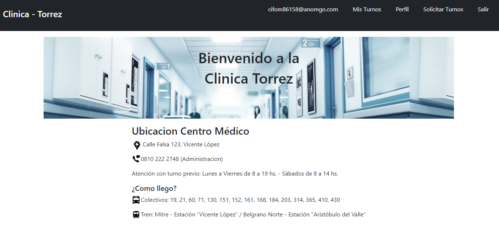
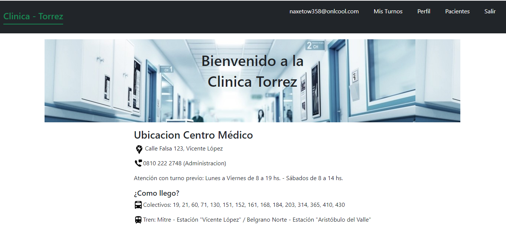
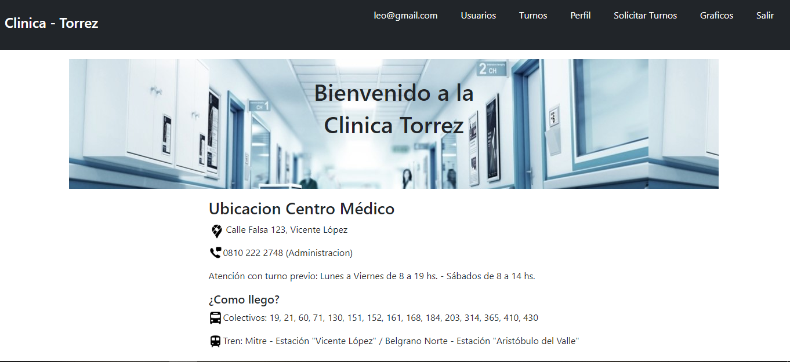

# TPClinica

La Clínica Online, especialista en salud, cuenta actualmente con consultorios (6 en la actualidad),
dos laboratorios (físicos en la clínica), y una sala de espera general. Está abierta al público de Lunes a
Viernes en el horario de 8:00 a 19:00, y los Sábados en el horario de 8:00 a 14:00. 
Esta pagina permite la administracion de turnos por parte del Paciente, Especialista y Administrador.

## Pantallas
### Home

Esta seccion muestra la pagina principal

### Ingresar

Esta seccion permite que ingreses a la pagina y en la esquina inferior derecha se encuentran los accesos rapidos.

### Registrarse

Esta seccion permite que el usuario se registre en la pagina. Los formularios de registro varian entre Paciente y Especialista.

### Usuarios

### Turnos

### Perfil

### Solicitar Turnos

### Graficos

### Mis Turnos

### Pacientes

## Usuario - Paciente

El Paciente puede acceder a...
 
Mis Turnos: 
En esta seccion el paciente ve todos sus turnos, los cuales puede cancelar en caso de ser necesario dejando un comentario del motivo. Tambien, al finalizar el mismo se le da la opcion de calificar la atencion del especialista y de ver la reseña del turno.
Tiene un filtro que le permite buscar por cualquier campo del Turno.

Perfil:
En esta seccion el paciente ve sus datos personales y tiene la opcion de bajar en PDF su historial clinico. Ya sea entero o filtrado por especialista.

Solicitar Turnos:
En esta seccion el paciente puede solicitar turnos medicos. Debe seleccionar alguna de las especialidades disponibles en la Clinica, al seleccionarla se le muestra los especialistas y sus turnos disponibles. 

## Usuario - Especialista

El Especialista puede acceder a...
 
Mis Turnos: 
En esta seccion el especialista ve todos los turnos que tiene asignado, los cuales puede cancelar/rechazar/aceptar/finalizar dependiendo la ocasion. 
Tambien al finalizar un turno debe llenar un formulario con el diagnostico y las variables fijas/dinamicas, y en caso de cancelar/rechazar debe dejar un comentario del motivo.
Tiene un filtro que le permite buscar por cualquier campo del Turno.

Perfil:
En esta seccion el especialista ve sus datos personales y puede asignar sus horarios de trabajo para cada una de sus especialidades.

Pacientes:
En esta seccion el especialista puede elegir un paciente (el cual debe haberse atendido con el minimo 1 vez) y acceder a su historial clinico.

## Usuario - Administrador

El Administrador puede acceder a...
 
Usuarios: 
En esta seccion el administrador puede registrar a un administrador o acceder al listado de Usuarios (Paciente/Especialista).
En el listado de Especialistas tiene la opcion de habilitar/inhabilitar al mismo y en el de Pacientes puede elegir a uno y descargar en un EXCEL que turnos tuvo y con quien.

Turnos:
En esta seccion el administrador puede ver todos los turnos de la Clinica y cancelar los mismos, dejando un comentario del motivo.
Tiene un filtro que le permite buscar por especialista y especialidad.

Perfil: 
En esta seccion el administrador ve sus datos personales.

Solicitar Turnos: 
En esta seccion el administrador puede solicitarle un turno a cualquier de los pacientes de la clinica. Al elegir el paciente se le habilita el elegir la especialidad, especialista y horario del turno.

Graficos:
En esta seccion el administrador puede ver el Log de Ingresos, y graficos que reflejan Turnos por Especialidad, Turnos por Dia, Turnos por Especialidad en un lapso de tiempo y Turnos por Especialidad Finalizados en un lapso de tiempo. Todos pueden descargarse en PDF.