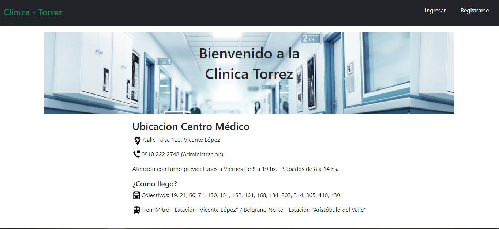
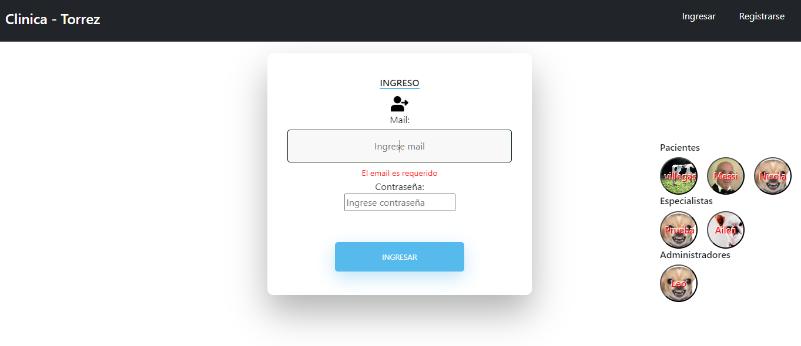
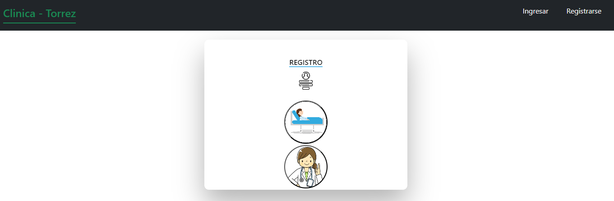
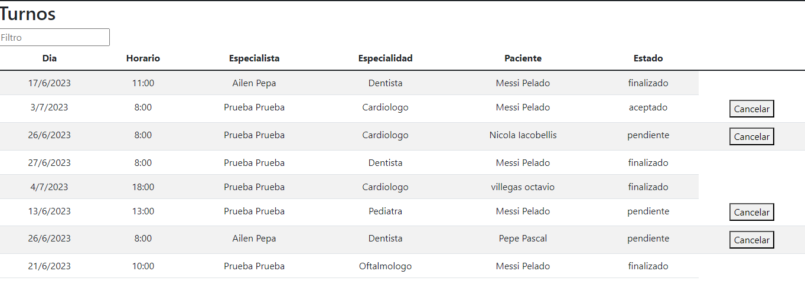
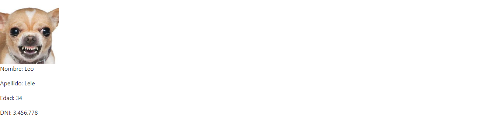
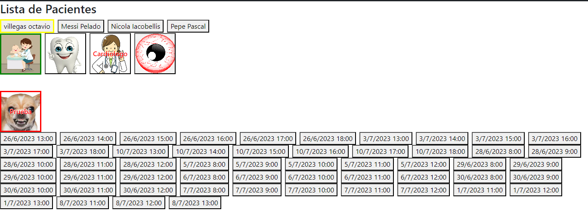
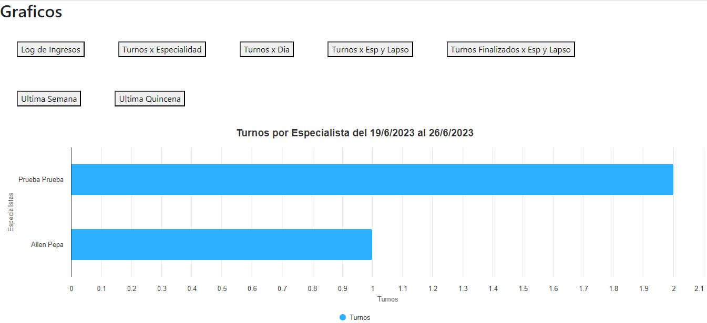
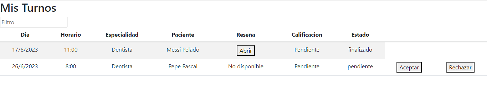
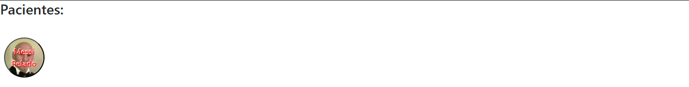

# TPClinica

La Clínica Online, especialista en salud, cuenta actualmente con consultorios (6 en la actualidad),
dos laboratorios (físicos en la clínica), y una sala de espera general. Está abierta al público de Lunes a
Viernes en el horario de 8:00 a 19:00, y los Sábados en el horario de 8:00 a 14:00. 
Esta pagina permite la administracion de turnos por parte del Paciente, Especialista y Administrador.

## Pantallas
### Home

### Ingresar

### Registrarse

### Usuarios

### Turnos

### Perfil

### Solicitar Turnos

### Graficos

### Mis Turnos

### Pacientes

## Usuario - Paciente

## Usuario - Especialista

## Usuario - Administrador